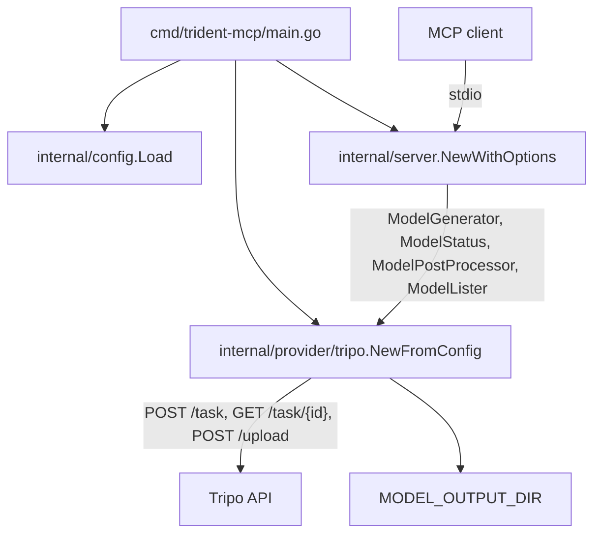
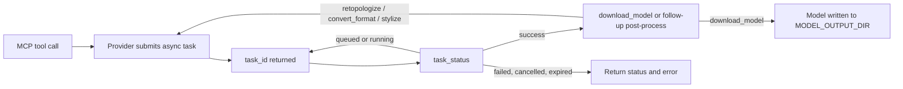

# Architecture

`trident-mcp` is a small Go MCP server with a clear split between three layers:

1. the process entrypoint and config loader
2. the MCP server that exposes tools
3. the provider implementation that speaks to Tripo

The current codebase is intentionally small, but it already follows a ports-and-adapters shape that keeps the server layer mostly independent from the Tripo-specific HTTP adapter.

## Runtime Layering

## Async Task Lifecycle

## File Layout

### Entrypoint and config

- [`cmd/trident-mcp/main.go`](cmd/trident-mcp/main.go) is the composition root. It loads config, constructs the Tripo provider, and injects that provider into the MCP server.
- [`internal/config/config.go`](internal/config/config.go) reads `TRIPO_API_KEY` and `MODEL_OUTPUT_DIR`, creates the output directory if needed, and reports the active backend metadata used by `get_config`.

### Provider boundary

- [`internal/provider/interfaces.go`](internal/provider/interfaces.go) defines the four capability interfaces:
  - `ModelGenerator`
  - `ModelStatus`
  - `ModelPostProcessor`
  - `ModelLister`
- [`internal/provider/types.go`](internal/provider/types.go) holds the shared request and response types used by both the MCP handlers and the provider implementation.

This is the main architectural seam in the project. The server layer depends on these interfaces rather than on a concrete Tripo type.

### MCP server

- [`internal/server/server.go`](internal/server/server.go) creates the MCP server and conditionally registers tools based on which provider interfaces are non-nil.
- [`internal/server/tools_generation.go`](internal/server/tools_generation.go) exposes generation, status, and download tools.
- [`internal/server/tools_postprocess.go`](internal/server/tools_postprocess.go) exposes retopology, format conversion, and stylization tools.
- [`internal/server/tools_config.go`](internal/server/tools_config.go) exposes `list_models` and `get_config`.

Conditional registration is important:

- generation tools are only registered when both `ModelGenerator` and `ModelStatus` are present
- post-process tools are only registered when both `ModelPostProcessor` and `ModelStatus` are present
- `list_models` is only registered when `ModelLister` is present
- `get_config` is always available

That keeps the published MCP surface aligned with what the backend can actually complete.

### Tripo adapter

The Tripo implementation is intentionally split by concern:

- [`internal/provider/tripo/provider.go`](internal/provider/tripo/provider.go) contains provider construction, shared HTTP helpers, task creation, and upload handling.
- [`internal/provider/tripo/generation.go`](internal/provider/tripo/generation.go) maps MCP generation requests to Tripo task payloads.
- [`internal/provider/tripo/status.go`](internal/provider/tripo/status.go) polls task state and downloads completed artifacts.
- [`internal/provider/tripo/postprocess.go`](internal/provider/tripo/postprocess.go) handles retopology, format conversion, and stylization tasks.
- [`internal/provider/tripo/models.go`](internal/provider/tripo/models.go) defines the server's built-in compatibility catalog and friendly model-version aliases.
- [`internal/provider/tripo/helpers.go`](internal/provider/tripo/helpers.go) provides filename generation, file-type detection, format inference, and download helpers.

## Design Choices

### Why `list_models` is static

`list_models` is backed by the catalog in [`internal/provider/tripo/models.go`](internal/provider/tripo/models.go), not by a live Tripo endpoint. That is intentional:

- the MCP surface stays deterministic
- tests do not need live network discovery
- aliases like `v3.1` and `p1` can be normalized consistently

The trade-off is that the catalog must be refreshed when Tripo updates its public model matrix.

### Why everything is task-oriented

Tripo is primarily an async task API, so the codebase is built around that assumption:

- generation and post-processing tools create tasks
- `task_status` polls those tasks
- `download_model` saves the resulting artifact locally

That model keeps the MCP interface simple, but it also means the current abstraction is optimized for task-based providers rather than synchronous or streaming backends.

## Extension Boundaries

The provider interfaces are a good foundation for additional backends, but the system is not yet fully backend-agnostic end-to-end.

Today:

- the server layer is provider-oriented and reusable
- the config loader assumes Tripo credentials
- the entrypoint always constructs the Tripo provider directly

So adding another backend would mostly involve implementing the interfaces, but it would also require wiring changes in:

- [`internal/config/config.go`](internal/config/config.go)
- [`cmd/trident-mcp/main.go`](cmd/trident-mcp/main.go)

## Testing Strategy

- [`internal/provider/tripo/*_test.go`](internal/provider/tripo) uses `httptest` to validate request mapping and response handling without calling the live API.
- [`internal/server/server_test.go`](internal/server/server_test.go) exercises the MCP layer with an in-memory client/server pair.
- [`internal/provider/tripo/e2e_test.go`](internal/provider/tripo/e2e_test.go) is intentionally minimal and opt-in because it spends live Tripo credits.

In practice, most changes should be validated with unit tests first, and E2E should be reserved for cases where mock coverage is not enough.
